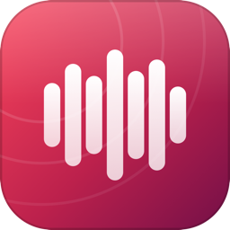
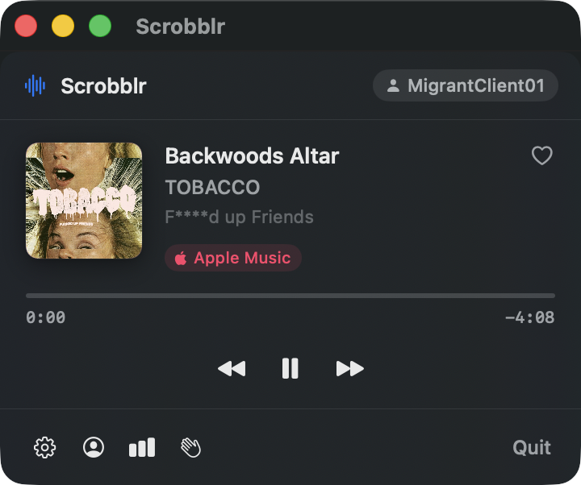
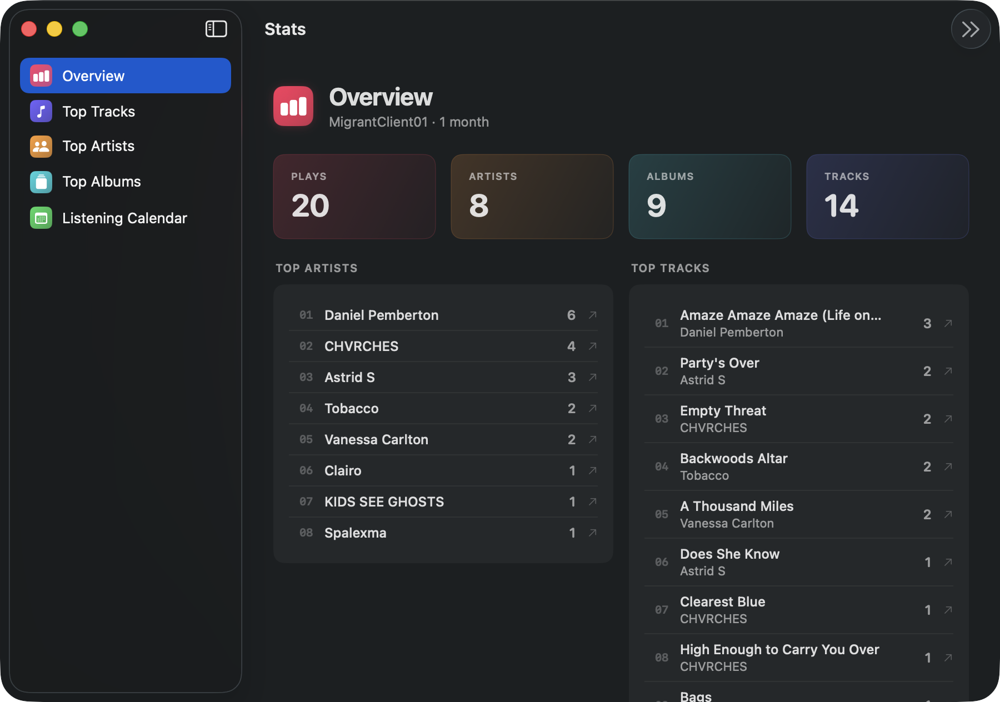
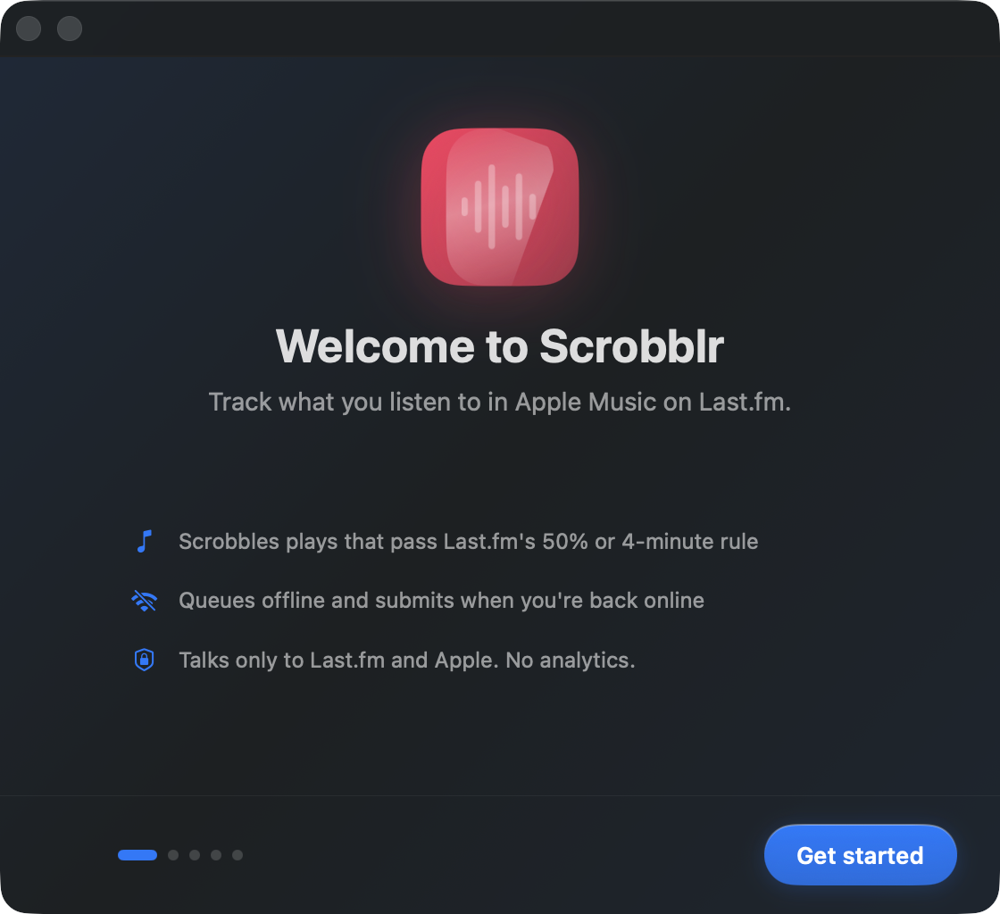

<h1 align="center">
  <br>
  Scrobblr
</h1>

<p align="center">
  A Last.fm scrobbler for Apple Music on macOS.<br>
  Menu bar agent. SwiftUI. Notarized.
</p>

<p align="center">
  <a href="https://github.com/asharahmed/scrobblr/releases/latest">
    
  </a>
  <a href="https://github.com/asharahmed/scrobblr/blob/main/LICENSE">
    
  </a>
  
  
</p>

<p align="center">
  <a href="https://github.com/asharahmed/scrobblr/releases/latest/download/Scrobblr.dmg"><strong>↓ Download Scrobblr.dmg</strong></a>
  &nbsp;·&nbsp;
  <a href="#setup">Setup</a>
  &nbsp;·&nbsp;
  <a href="PRIVACY.md">Privacy</a>
  &nbsp;·&nbsp;
  <a href="DEVELOPMENT.md">Build from source</a>
</p>

---

## What it does

Scrobblr watches Apple Music for what you're playing and submits it to Last.fm. It lives in your menu bar, queues plays while you're offline, and quietly catches up when you're back online.

<p align="center">
  
</p>

<p align="center">
  
  &nbsp;
  
</p>

|   | |
|---|---|
| **Reliable** | Every play that meets Last.fm's 50% / 4-minute rule is queued and submitted. Pending plays survive reboots, sleep, and offline stretches. |
| **Private** | No analytics. No server in the middle: your plays go straight to Last.fm, and album art comes from Apple's anonymous Search API. |
| **Honest** | Custom Music access permission flow with pre-prompt explainers. Credentials live in your Keychain. Logs redact track titles. |
| **Yours** | Bring your own Last.fm API key. No shared key that can break the app for everyone if it gets revoked. |
| **Quiet** | Pause for an hour, ignore specific artists, override the scrobble threshold, skip podcasts and audiobooks. |

## Install

1. Download [`Scrobblr.dmg`](https://github.com/asharahmed/scrobblr/releases/latest/download/Scrobblr.dmg) from the [latest release](https://github.com/asharahmed/scrobblr/releases/latest).
2. Open the DMG and drag **Scrobblr** to **Applications**.
3. Launch it. The welcome window walks you through setup in four steps.

> Move Scrobblr to Applications before launching. Running from Downloads triggers macOS quarantine translocation, which breaks Launch-at-login and software updates. Scrobblr warns on first launch if it detects this.

## Setup

### 1. Bring your own Last.fm API key

Each user registers their own Last.fm application. It's free and takes 30 seconds.

1. Visit <https://www.last.fm/api/account/create>.
2. Fill in any Application name. Leave Callback URL and Application homepage blank.
3. Submit. Last.fm shows a 32-character API Key and a 32-character Shared Secret.
4. Paste both into the Scrobblr welcome window.

Both values are stored in your macOS Keychain and only sent to Last.fm.

### 2. Sign in to Last.fm

Click **Sign in with Last.fm**. The browser opens to Last.fm's approval page. Click **Yes, allow access**. Scrobblr detects the approval and signs you in.

### 3. Allow access to Music.app

macOS asks once: "Scrobblr would like to control Music." Click **OK**. Scrobblr only reads; it cannot start, stop, or change tracks.

### 4. Done

Scrobblr lives in the menu bar. Play music. Scrobbles flow once tracks cross Last.fm's threshold.

## Features

**Menu bar**

- Smooth-progress now-playing display with album art
- Love and un-love the current track
- Origin badge: Library, Apple Music, Stream, Podcast, Audiobook, Music Video
- Live status: scrobbled, queued, submitting, paused, needs re-auth

**Settings**

- **Account**: sign in and out, view profile, manage Last.fm app authorizations, replace API key
- **Playback**: Music access status, scrobble-threshold sliders, content filter, ignored artists and tracks
- **General**: launch at login, software updates, replay welcome flow, export diagnostics, report a bug
- **Activity**: today and 7-day scrobble totals, pause scrobbling, submission queue, recent scrobbles
- **About**: version, acknowledgments, privacy policy, license

**Engine**

- Distributed-notification-based playback detection
- Monotonic elapsed-time accumulator immune to wall-clock skew
- Honors Last.fm's per-track ignore responses
- Sleep and network-aware queue management
- Sparkle 2 EdDSA-signed auto-updates

## How it works

Scrobblr uses two playback signals, since neither alone is enough on current macOS.

```
DistributedNotificationCenter         ──┐
  (com.apple.Music.playerInfo)          │
                                        ├──►  PlaybackObserver  ──►  ScrobbleEngine  ──►  Queue  ──►  Last.fm
NSAppleScript poll (Music.app)        ──┘
  (1 Hz position, fallback metadata)
```

Architecture details and the build pipeline live in [`DEVELOPMENT.md`](DEVELOPMENT.md).

## Privacy

Scrobblr doesn't run a server. The author doesn't receive your data. Total outbound network traffic:

- **Last.fm** (`ws.audioscrobbler.com`): scrobbles and auth
- **Apple iTunes Search** (`itunes.apple.com`): anonymous album-art lookup
- **GitHub Pages**: software update checks via Sparkle

Full policy: [PRIVACY.md](PRIVACY.md).

## Troubleshooting

**Music is playing, but Scrobblr says "Nothing playing".**
Scrobblr detects playback when a track starts or changes, so it can miss music that was already playing before it launched. Pause and play once to refresh.

**The progress bar is stuck at 0.**
Music access was denied. Settings → Playback → Recheck. If Denied, click **Open System Settings** and re-enable Scrobblr under Privacy & Security → Automation → Scrobblr → Music.

**Scrobbles aren't showing up on Last.fm.**
A track must play for at least 50% of its duration or 4 minutes (your threshold may differ). Check Settings → Activity for queue and recent submissions. If "Sign-in expired" appears, use **Sign in again** in the menu bar or Settings → Account.

**My account is on two Macs.**
Apple Music syncs queue across devices. Both Macs running Scrobblr will double-scrobble. Run Scrobblr on only one machine.

**How do I see logs?**

```
log stream --predicate 'subsystem == "app.scrobblr"' --info
```

Categories: `playback`, `scrobble`, `api`, `auth`, `lifecycle`. Track titles and artists are redacted in logs unless macOS private-data logging is enabled.

**How do I uninstall?**
Quit Scrobblr from the menu bar. Drag the app to Trash. Delete `~/Library/Application Support/Scrobblr/`. Remove Keychain items by searching "Scrobblr" in Keychain Access. Revoke API access at <https://www.last.fm/settings/applications>.

## Reporting bugs

Open an issue at <https://github.com/asharahmed/scrobblr/issues>. Please include:

- macOS version (`sw_vers -productVersion`)
- Scrobblr version (Settings → About)
- A diagnostics bundle (Settings → General → Export diagnostics)

## License

MIT. See [LICENSE](LICENSE).

## Acknowledgments

Built with help from Claude Opus (Anthropic).

---

<p align="center">
  <sub>
    Apple, Apple Music, Mac, and macOS are trademarks of Apple Inc., registered in the U.S. and other countries and regions.<br>
    Last.fm is a trademark of Last.fm Limited. Scrobblr is independent and unaffiliated.
  </sub>
</p>
